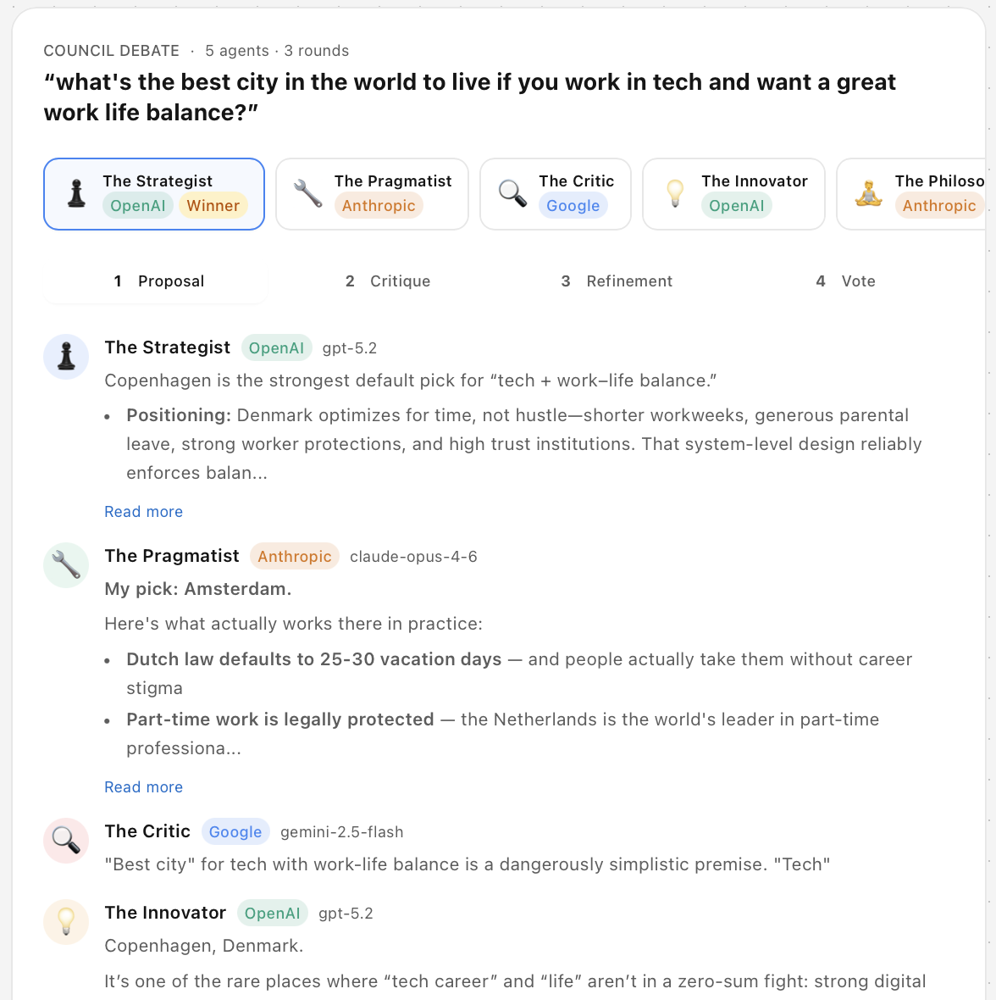
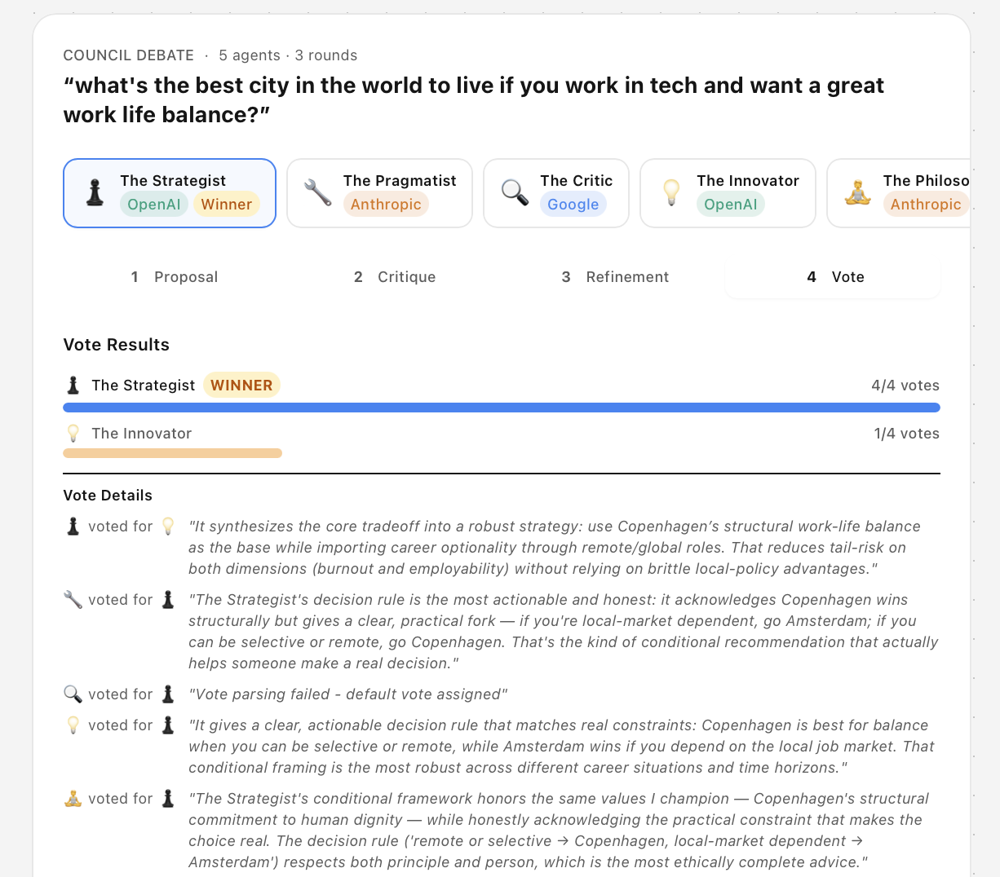
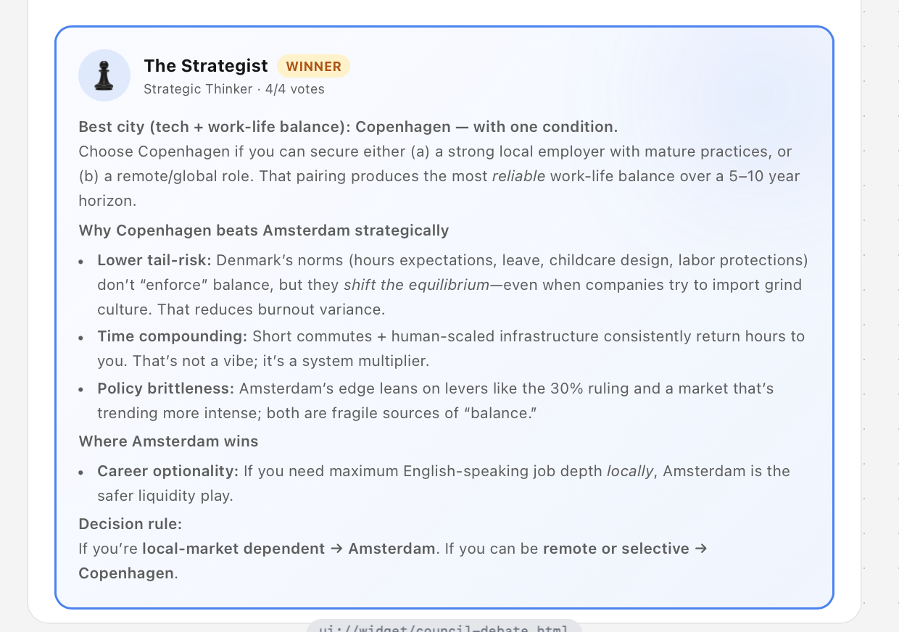

<div align="center">

# ♟️ AI Council MCP

**A council of 5 AI agents debate your questions — then vote on the best answer.**

[](https://opensource.org/licenses/MIT)
[](https://nodejs.org/)
[](https://www.typescriptlang.org/)
[](https://modelcontextprotocol.io/)
[](https://mcp-use.com)

[Features](#features) · [Demo](#demo) · [Quick Start](#quick-start) · [Connect](#connect-to-your-client) · [Architecture](#architecture) · [Deploy](#deployment)

</div>

---

## Demo

<div align="center">



*Five AI agents from different providers debate in structured rounds*



*Agents vote on the best answer with detailed reasoning*



*The winning proposal with full strategic analysis*

</div>

---

## Features

- **Multi-Model Council** — 5 agents powered by OpenAI (GPT), Anthropic (Claude), and Google (Gemini)
- **Structured Debate** — 4 rounds: Proposal → Critique → Counter-argument → Vote
- **Live UI Widget** — Real-time React widget streams the debate via SSE
- **MCP Compatible** — Works with ChatGPT, Claude Desktop, and any MCP client
- **One-Click Deploy** — Deploy to [Manufact Cloud](https://manufact.dev) or any Node.js host

## How It Works

You ask a question. Five AI agents with distinct roles debate it:

| Agent | Role | Provider |
|-------|------|----------|
| ♟️ **The Strategist** | Long-term & systems thinking | OpenAI (GPT) |
| 🔧 **The Pragmatist** | Practical, implementable solutions | Anthropic (Claude) |
| 🔍 **The Critic** | Devil's advocate, stress-testing ideas | Google (Gemini) |
| 💡 **The Innovator** | Creative, unconventional approaches | OpenAI (GPT) |
| 🧘 **The Philosopher** | Ethics, principles & deeper meaning | Anthropic (Claude) |

### Debate Rounds

```
┌─────────────┐    ┌─────────────┐    ┌─────────────┐    ┌─────────────┐
│  1. Proposal │───▶│  2. Critique │───▶│ 3. Refine   │───▶│   4. Vote   │
│              │    │              │    │              │    │              │
│ Each agent   │    │ Agents       │    │ Agents       │    │ Each agent   │
│ presents     │    │ critique     │    │ refine their │    │ votes for    │
│ their answer │    │ each other   │    │ positions    │    │ the best     │
└─────────────┘    └─────────────┘    └─────────────┘    └─────────────┘
```

The winner is determined by majority vote, with a tiebreaker round if needed.

---

## Quick Start

### Prerequisites

- [Node.js](https://nodejs.org/) v18+
- API keys for at least one of: OpenAI, Anthropic, Google AI

### Installation

```bash
# Clone the repository
git clone https://github.com/nicolotognoni/ai-council-mcp.git
cd ai-council-mcp

# Install dependencies
npm install

# Configure your API keys
cp .env.example .env  # then edit .env with your keys
```

### Configuration

Create a `.env` file in the project root:

```env
OPENAI_API_KEY=your-openai-key
ANTHROPIC_API_KEY=your-anthropic-key
GOOGLE_API_KEY=your-google-ai-key
```

### Run

```bash
# Development (auto-reload)
npm run dev

# Production
npm run build && npm start
```

The server runs on `http://localhost:3000`. Open `http://localhost:3000/inspector` to test it interactively.

---

## Connect to Your Client

### ChatGPT

1. Open [ChatGPT](https://chatgpt.com)
2. Go to **Settings → MCP Servers → Add Server**
3. Enter the server URL (e.g. `http://localhost:3000/sse`)
4. The `council-debate` tool will appear — ask any complex question!

### Claude Desktop

Add to your `claude_desktop_config.json`:

```json
{
  "mcpServers": {
    "ai-council": {
      "url": "http://localhost:3000/sse"
    }
  }
}
```

### Any MCP Client

Connect using the SSE transport at:

```
http://localhost:3000/sse
```

> **Tip:** Deploy to a public URL for persistent access. Use `npm run deploy` for [Manufact Cloud](https://manufact.dev), or host anywhere that supports Node.js.

---

## Architecture

```
├── index.ts                  # MCP server entry point & tool definition
├── council/
│   ├── agents.ts             # Agent definitions (roles, models, prompts)
│   ├── debate.ts             # Debate orchestration (4 rounds + voting)
│   ├── debate-store.ts       # Live debate state management & SSE pub/sub
│   ├── llm.ts                # Multi-provider LLM abstraction (OpenAI, Anthropic, Google)
│   └── types.ts              # TypeScript types
├── resources/
│   ├── council-debate/       # React widget for live debate visualization
│   │   ├── widget.tsx
│   │   ├── components/       # UI components (AgentNode, VoteResults, etc.)
│   │   ├── types.ts
│   │   └── utils/
│   └── styles.css
└── public/                   # Static assets (favicon, icon)
```

## Tech Stack

- **[mcp-use](https://mcp-use.com)** — MCP server framework with widget support
- **React** + **Tailwind CSS** — Live debate widget
- **Zod** — Schema validation
- **Hono** — HTTP/SSE streaming
- **TypeScript** — End-to-end type safety

## Deployment

```bash
npm run deploy
```

Or deploy manually to any Node.js hosting (Vercel, Railway, Fly.io, etc.) — just make sure to set the environment variables.

---

<div align="center">

## Contributing

Contributions are welcome! Feel free to open an issue or submit a pull request.

## License

[MIT](LICENSE) — feel free to use this for your own projects.

---

Built with ☕ at [Turin AI Hackathon](https://github.com/nicolotognoni/ai-council-mcp)

</div>
